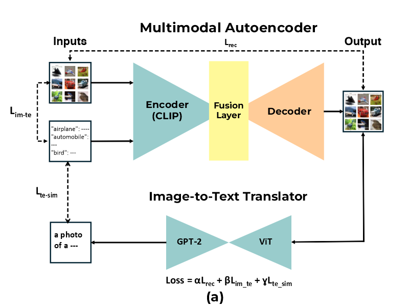
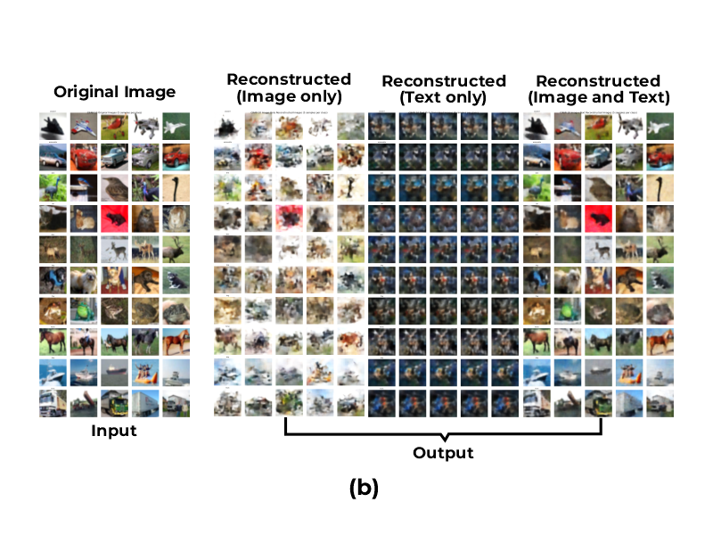

# Multimodal-Learning-for-Autoencoders
Repository of my SIGGRAPH Asia 2024 work (poster).

In Multimodal Autoencoder the image is reconstructed using both image and text as inputs, rather than only image as an input.

Following figure shows the architecture daigram and training scheme of our Multimodal Autoencoder.


The qualititaive results on CIFAR-10 are as follows.


Images reconstructed from both image and text inputs are better than only one modality as an input.


### Citation
Kindly cite this paper, if it is helpful to you

```
@inproceedings{10.1145/3681756.3697974,
author = {Khan, Wajahat Ali and Lee, Seungkyu},
title = {Multimodal Learning for Autoencoders},
year = {2024},
isbn = {9798400711381},
publisher = {Association for Computing Machinery},
address = {New York, NY, USA},
url = {https://doi.org/10.1145/3681756.3697974},
doi = {10.1145/3681756.3697974},
abstract = {In this work, Multimodal Autoencoder is proposed in which images are reconstructed using both image and text inputs, rather than just images. Two new loss terms are introduced: Image-Text-loss (Lim − te) that measures similarity between input image and input text, and Text-Similarity-loss (Lte − sim) that measures similarity between generated text from the reconstructed image and input text. Our experiments demonstrate that images reconstructed using both modalities (image and text) are of significantly higher quality than those reconstructed from either modality alone, highlighting how features learned from one modality can enhance another in the reconstruction process.},
booktitle = {SIGGRAPH Asia 2024 Posters},
articleno = {62},
numpages = {2},
keywords = {Computer Vision, Natural Language, Autoencoder, Multimodality},
location = {
},
series = {SA '24}
}
```
